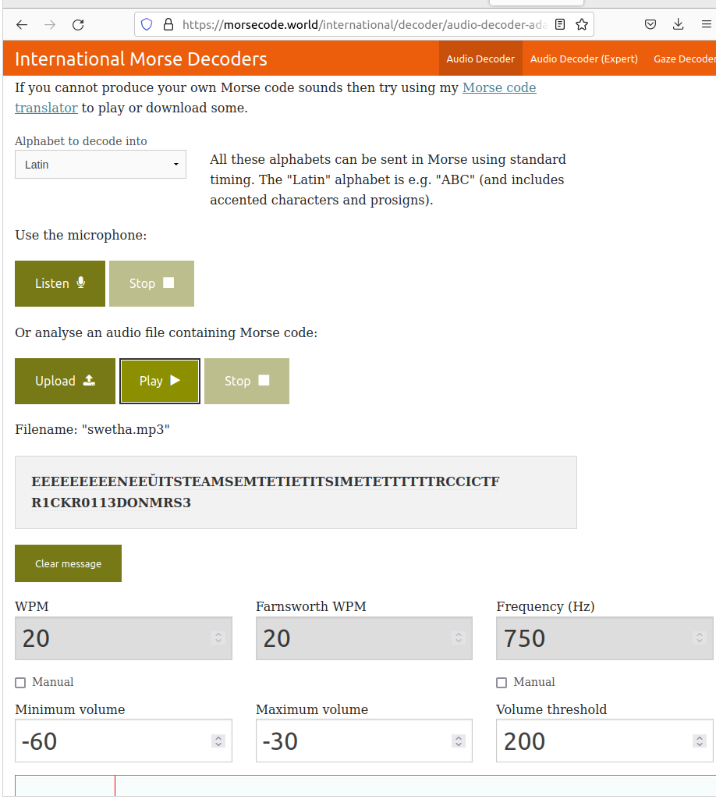

### Dots&Dashes
Description

Decrypt the audio to find the flag!!

Author : JB

Flag Format:
ictf{flag-allcaps_nospace}

### solution 

The following file has to be downloaded
<a href= "https://raw.githubusercontent.com/swetaajit/indyctf/main/Dots%26Dashes/swetha.mp3">challengefile.mp3.</a>

This morse code  audio file is then decoded .After decoding it looks something like this.

From this one could decrypt the flag 
The flag being
R1CKR0113DONMRS3

###
ICTF{R1CKR0113DONMRS3}

